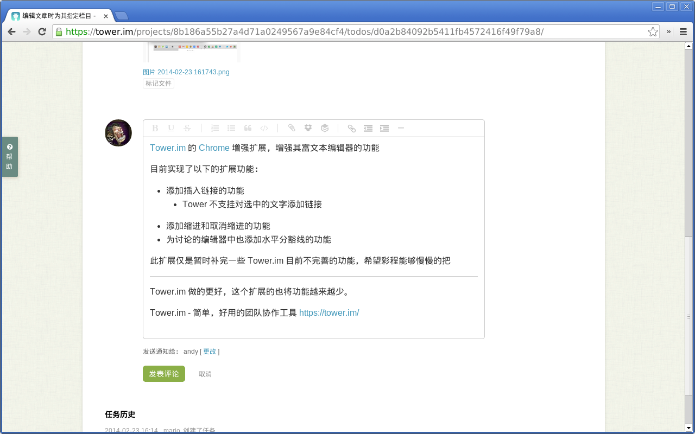
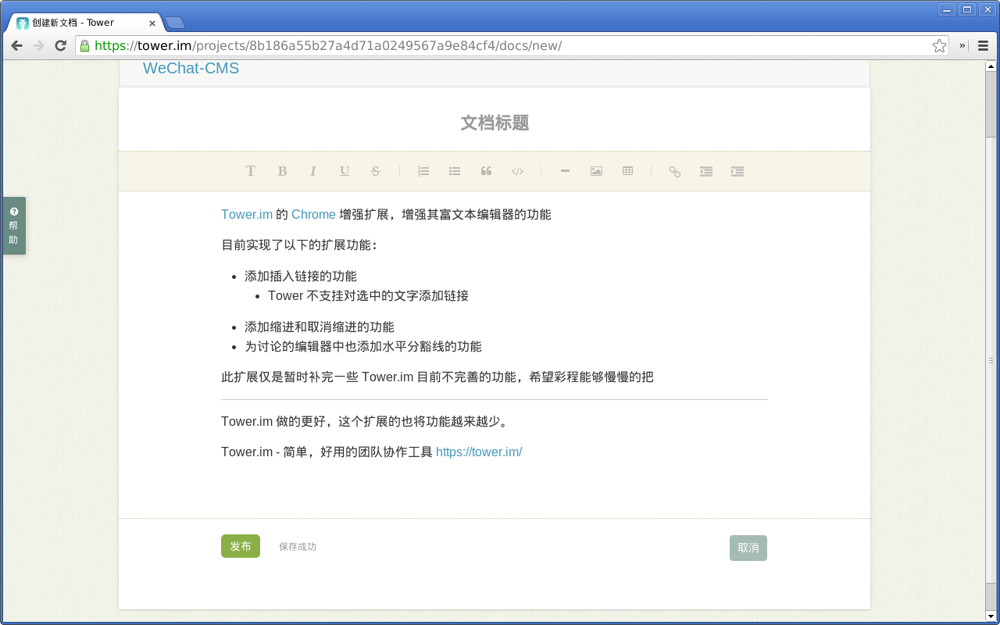

Tower.im Plus
===============

Tower.im 的 Chrome 增强扩展，增强其富文本编辑器的功能

目前实现了以下的扩展功能：

- 添加插入链接的功能
- 添加缩进和取消缩进的功能
- 为讨论的编辑器中也添加水平分豁线的功能

此扩展仅是暂时补完一些 Tower.im 目前不完善的功能，希望彩程能够慢慢的把
Tower.im 做的更好，这个扩展的也将功能越来越少。

Tower.im - 简单，好用的团队协作工具 https://tower.im/